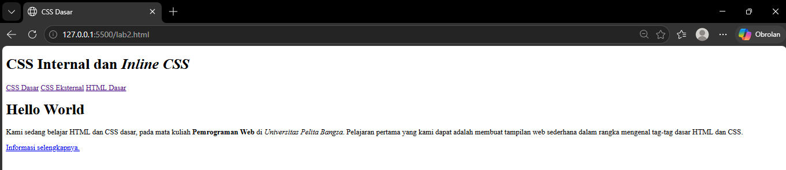
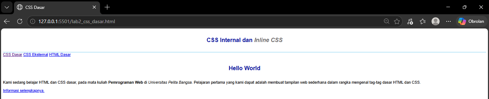
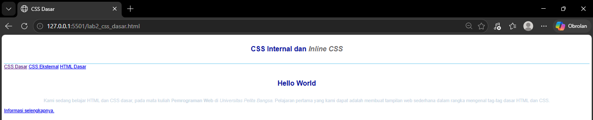
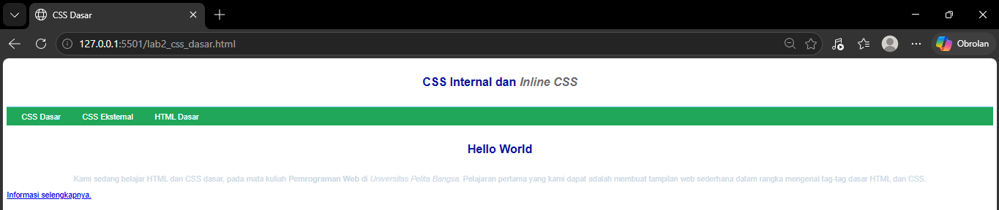
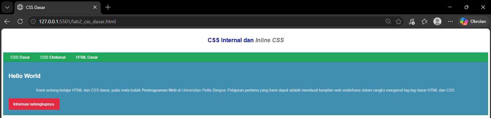
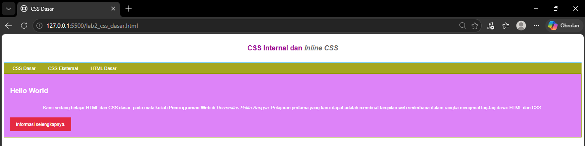

# Lab3Web - Praktikum 3 Pemrograman Web (CSS Dasar)

| | |
|---|---|
| **Nama** | Rafa Muhammad Fauzan |
| **NIM** | 312510277 |
| **Kelas** | I251C |
| **Program Studi** | Teknik Informatika |
| **Mata Kuliah** | Pemrograman Web |
| **Topik** | CSS Dasar: penulisan internal, eksternal, inline, dan selector |

**📄 Halaman:** [README (Laporan Praktikum)](README.md) | [JAWABAN (Jawaban Pertanyaan)](JAWABAN.md)

## Deskripsi

Repository ini berisi hasil Praktikum 3 Pemrograman Web. Praktikum ini membahas *Cascading Style Sheet* (CSS), yaitu aturan untuk mengatur tampilan halaman web agar lebih terstruktur dan seragam. Dipelajari tiga cara penulisan CSS (internal, eksternal, inline) serta tiga jenis selector (elemen, class, dan id).

## Tujuan Praktikum

1. Memahami konsep dasar CSS.
2. Memahami aturan penulisan pada CSS.
3. Memahami selector sebagai pengontrol CSS.
4. Membuat pengaturan CSS pada HTML.

## Alat yang Digunakan

- Visual Studio Code
- Web browser (Google Chrome / Mozilla Firefox)
- [CSS Validator W3C](https://jigsaw.w3.org/css-validator/) untuk validasi dokumen CSS
- Git dan GitHub

## Struktur Repository

```
Lab3Web/
├── lab2_css_dasar.html   # Halaman utama: struktur HTML + CSS internal + inline
├── style_eksternal.css   # CSS eksternal: nav, ID selector, class selector
├── screenshots/          # Screenshot hasil tiap langkah
├── JAWABAN.md            # Jawaban pertanyaan praktikum
└── README.md
```

---

## Konsep Dasar CSS

CSS (*Cascading Style Sheet*) adalah aturan untuk mengatur tampilan komponen dalam sebuah web agar lebih terstruktur dan seragam. CSS bukan bahasa pemrograman. Dengan CSS, cukup mengubah satu berkas *style* untuk mengubah tampilan di banyak halaman sekaligus.

Perintah CSS terdiri dari dua komponen:

```
h1 { color: blue; }
└┬┘  └──────┬───┘
selector  declaration
```

- **Selector** menunjuk elemen HTML mana yang diberi gaya. Bisa berupa elemen HTML, class, atau id.
- **Declaration** adalah aturan yang diterapkan, terdiri dari *property* (misalnya `color`) dan *value* (misalnya `blue`).

### Tiga Cara Penulisan CSS

| Cara | Penjelasan | Penulisan |
|---|---|---|
| **Internal** | Kode CSS ditulis di dalam dokumen HTML, pada bagian `<head>`. | Tag `<style>` |
| **Eksternal** | Kode CSS ditulis terpisah dalam berkas `.css` sendiri. | Tag `<link rel="stylesheet" href="...">` |
| **Inline** | Kode CSS ditulis langsung sebagai atribut pada tag HTML. Hanya memengaruhi satu baris elemen. | Atribut `style="..."` |

### Tiga Jenis CSS Selector

| Selector | Penulisan deklarasi | Penulisan di HTML | Cakupan |
|---|---|---|---|
| **Elemen** | `p { ... }` | — (langsung ke tag) | Semua elemen dengan tag tersebut |
| **Class** | `.nama { ... }` | `class="nama"` | Semua elemen yang memakai class tersebut, boleh lebih dari satu class per elemen |
| **ID** | `#nama { ... }` | `id="nama"` | Satu elemen saja, karena id harus unik dalam satu halaman |

---

## Langkah 1: Membuat Dokumen HTML

File `lab2_css_dasar.html` dibuat dengan struktur dasar: `header`, `nav` dengan tiga tautan, dan `div id="intro"` berisi judul, paragraf, serta tombol.

```html
<!DOCTYPE html>
<html lang="en">
<head>
    <meta charset="UTF-8">
    <meta name="viewport" content="width=device-width, initial-scale=1.0">
    <title>CSS Dasar</title>
</head>
<body>
    <header>
        <h1>CSS Internal dan <i>Inline CSS</i></h1>
    </header>
    <nav>
        <a href="lab2_css_dasar.html">CSS Dasar</a>
        <a href="lab2_css_eksternal.html">CSS Eksternal</a>
        <a href="lab1_tag_dasar.html">HTML Dasar</a>
    </nav>
    <!-- CSS ID Selector -->
    <div id="intro">
        <h1>Hello World</h1>
        <p>Kami sedang belajar HTML dan CSS dasar, pada mata kuliah <b>Pemrograman Web</b> di <i>Universitas Pelita Bangsa</i>. Pelajaran pertama yang kami dapat adalah membuat tampilan web sederhana dalam rangka mengenal tag-tag dasar HTML dan CSS.</p>
        <!-- CSS Class Selector -->
        <a class="button btn-primary" href="#intro">Informasi selengkapnya.</a>
    </div>
</body>
</html>
```

**Penjelasan:** `div id="intro"` disiapkan sebagai target ID selector, dan tombol `<a class="button btn-primary">` disiapkan sebagai target class selector pada langkah berikutnya.

**Hasil:**



---

## Langkah 2: Mendeklarasikan CSS Internal

CSS internal ditambahkan di dalam tag `<style>` pada bagian `<head>`.

```html
<head>
    <title>CSS Dasar</title>
    <style>
        body {
            font-family:'Open Sans', sans-serif;
        }
        header {
            min-height: 80px;
            border-bottom:1px solid #77CCEF;
        }
        h1 {
            font-size: 24px;
            color: #0F189F;
            text-align: center;
            padding: 20px 10px;
        }
        h1 i {
            color:#6d6a6b;
        }
    </style>
</head>
```

**Penjelasan:**

| Selector | Yang diatur |
|---|---|
| `body` | Jenis huruf untuk seluruh halaman. |
| `header` | Tinggi minimum dan garis bawah. |
| `h1` | Ukuran huruf, warna, perataan tengah, dan jarak dalam (`padding`). |
| `h1 i` | Selector turunan: elemen `<i>` yang berada **di dalam** `<h1>` diberi warna abu-abu, berbeda dari warna `h1` di sekelilingnya. |

**Hasil:**



---

## Langkah 3: Menambahkan Inline CSS

Inline CSS ditambahkan langsung sebagai atribut `style` pada tag `<p>`.

```html
<p style="text-align: center; color: #ccd8e4;">
    Kami sedang belajar HTML dan CSS dasar, pada mata kuliah <b>Pemrograman Web</b> di <i>Universitas Pelita Bangsa</i>. ...
</p>
```

**Penjelasan:** Gaya ini hanya berlaku untuk tag `<p>` tersebut, tidak memengaruhi paragraf lain di halaman. Warnanya dibuat lebih muda (`#ccd8e4`) dibanding warna standar teks sehingga terlihat memudar dibanding sebelumnya.

**Hasil:**



---

## Langkah 4: Membuat CSS Eksternal

Dibuat berkas baru `style_eksternal.css`, berisi pengaturan untuk elemen `nav`.

```css
nav {
    background: #20A759;
    color:#fff;
    padding: 10px;
}
nav a {
    color: #fff;
    text-decoration: none;
    padding:10px 20px;
}
nav .active,
nav a:hover {
    background: #0B6B3A;
}
```

Berkas tersebut dihubungkan ke `lab2_css_dasar.html` lewat tag `<link>` di `<head>`:

```html
<head>
    <!-- menyisipkan css eksternal -->
    <link rel="stylesheet" href="style_eksternal.css" type="text/css">
</head>
```

**Penjelasan:**

| Kode | Fungsi |
|---|---|
| `<link rel="stylesheet" href="...">` | Menghubungkan dokumen HTML dengan berkas CSS eksternal. |
| `nav` | Memberi warna latar hijau, teks putih, dan jarak dalam pada elemen navigasi. |
| `nav a` | Menghilangkan garis bawah tautan dan memberi jarak antartautan. |
| `nav a:hover` | *Pseudo-class*: gaya yang aktif saat kursor diarahkan ke tautan (warna latar jadi hijau tua). |
| `nav .active` | Gaya untuk tautan yang sedang aktif/dipilih, memakai warna latar yang sama dengan `:hover`. |

**Hasil:**



---

## Langkah 5: Menambahkan CSS Selector (ID dan Class)

Ditambahkan ID selector dan class selector pada `style_eksternal.css`.

```css
/* ID Selector */
#intro {
    background: #418fb1;
    border: 1px solid #099249;
    min-height: 100px;
    padding: 10px;
}
#intro h1 {
    text-align: left;
    border: 0;
    color: #fff;
}

/* Class Selector */
.button {
    padding: 15px 20px;
    background: #bebcbd;
    color: #fff;
    display: inline-block;
    margin: 10px;
    text-decoration: none;
}
.btn-primary {
    background: #E42A42;
}
```

**Penjelasan:**

| Selector | Fungsi |
|---|---|
| `#intro` | Memberi gaya pada elemen dengan `id="intro"`: latar biru, border hijau, jarak dalam. |
| `#intro h1` | Selector turunan: `<h1>` di dalam `#intro` diratakan kiri dan diberi warna putih, menimpa gaya `h1` dari CSS internal (lihat [Jawaban Pertanyaan No. 2](JAWABAN.md)). |
| `.button` | Gaya dasar tombol: jarak dalam, latar abu-abu, teks putih, tampil sebagai `inline-block`. |
| `.btn-primary` | Gaya tambahan yang menimpa warna latar `.button` menjadi merah, karena elemen `<a class="button btn-primary">` memakai dua class sekaligus. |

**Hasil:**



---

## Eksperimen CSS

Sebagai latihan tambahan, dilakukan eksperimen mengubah dan menambah properti serta nilai pada kode CSS dengan mengacu pada CSS Cheat Sheet, misalnya mengganti warna, jenis huruf, atau jarak antarelemen, lalu mengamati perubahannya di browser.

**Hasil:**



---

## Jawaban Pertanyaan

Jawaban dari pertanyaan praktikum ada di berkas terpisah: [JAWABAN.md](JAWABAN.md).

## Cara Menjalankan

1. Clone repository:
   ```bash
   git clone https://github.com/RafaMuhammadFauzan13/Lab3Web.git
   ```
2. Buka folder `Lab3Web`.
3. Buka `lab2_css_dasar.html` di browser.

## Kesimpulan

Dari praktikum ini saya belajar bahwa:

- CSS mengatur tampilan halaman web secara terpisah dari strukturnya (HTML), sehingga lebih mudah dikelola dan diseragamkan.
- Ada tiga cara menulis CSS: internal (di `<style>`), eksternal (berkas `.css` terpisah), dan inline (atribut `style` pada tag).
- Selector menentukan elemen mana yang diberi gaya: elemen HTML, class (`.`), atau id (`#`).
- Ketika beberapa aturan CSS bentrok pada elemen yang sama, browser menentukan gaya mana yang dipakai berdasarkan urutan dan spesifisitas selector (dijelaskan lebih lanjut di [JAWABAN.md](JAWABAN.md)).

## Referensi

- Modul Praktikum 3: CSS Dasar, Universitas Pelita Bangsa
- [MDN Web Docs - CSS](https://developer.mozilla.org/en-US/docs/Web/CSS)
